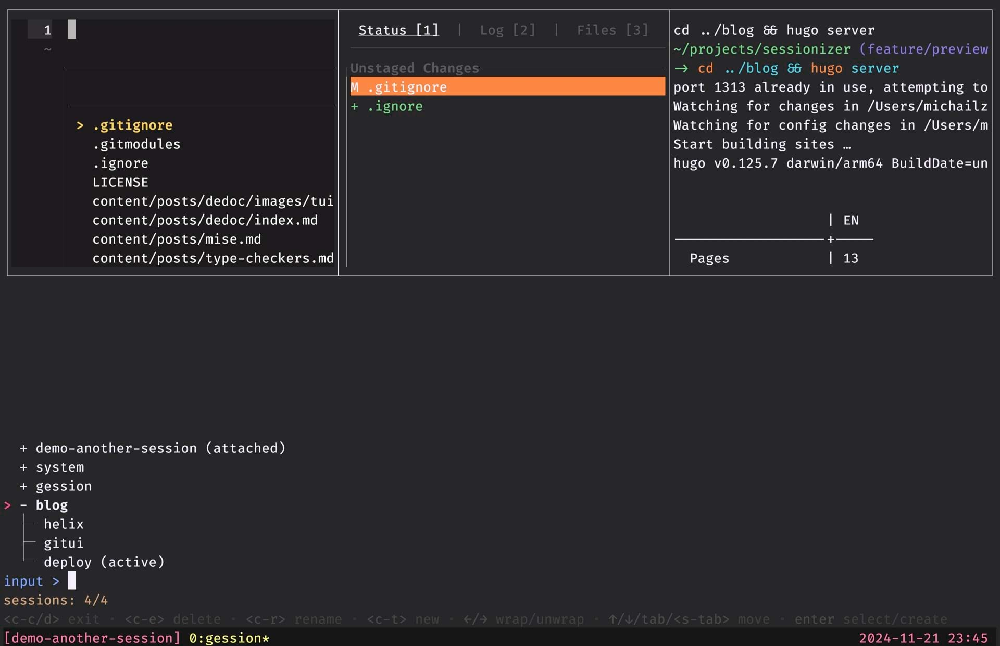

# Gession

Lightweight Tmux Session Manager, just one binary and you are good to go.

## Screenshot



## Demo

<picture>
  
</picture>

## Features

- **Extremely Fast**: Efficiently written in Go, so it's blazing fast.
- **Lightweight**: The tool isn't bloated with large libraries or dependencies.
- **Interactive TUI**: A TUI allows you to view, create, switch, and terminate tmux sessions.
- **Fuzzy Search**: Quickly find and filter sessions using fuzzy search.
- **Two Modes**: Two modes are supported:
  * Normal: allows you to manage existing tmux sessions.
  * Prime: allows you to create Tmux sessions based on directories.

## Installation

To get started, install the tool using `go install`:

```sh
go install github.com/verte-zerg/gession/cmd/gession@latest
```

Alternatively, you can install it from source by cloning the repository and building the project:

```sh
git clone https://github.com/verte-zerg/gession.git
cd gession
make build
``` 

## Usage

### Normal Mode

Run it with the following command:

```sh
./gession
```

### Prime Mode

The `--prime` mode allows you to list directories instead of tmux sessions. This is useful for quickly creating sessions based on project directories.

To use the `--prime` mode, specify the `--prime` flag and provide one or more directories to search for sessions using the `--pd` flag:

```sh
./gession --prime --pd /path/to/dir1 --pd /path/to/dir2
```

### Configuration

Add the following line to your `.tmux.conf` file:
```sh
# Basic
bind o run-shell "tmux neww path/to/gession"
bind p run-shell "tmux neww path/to/gession --prime --pd /path/to/projects"

# Advanced
bind o run-shell "tmux neww path/to/gession -d /path/to/directory"
bind p run-shell "tmux neww path/to/gession --prime --pd /path/to/projects --pd /path/to/other/projects"
```

By default, `go install` installs binaries in the `$GOPATH/bin` directory.
`$GOPATH` by default points to `$home/go` on Unix and `%USERPROFILE%\go` on Windows.

To avoid the need to specify the full path to the binary, you can move it to a directory in your `$PATH`.
Add the following line to your shell configuration file (`~/.bashrc`, `~/.zshrc`, `~/.config/fish/config.fish`):
```sh
# BASH/ZSH
export PATH=$PATH:/path/to/gession  # $HOME/go/bin

# FISH
fish_add_path /path/to/gession  # $HOME/go/bin
```

After specifying the path, you can run the TUI with the following commands:
```sh
# From the terminal
gession

# In tmux.conf
bind f run-shell "tmux neww gession"
```

## Navigation

- **Up/Down Arrow**: Move up or down in the session list.
- **Enter**: Enter the highlighted session or create a new one.
- **Backspace**: Delete the last character in the input.
- **Esc/^C/^D**: Exit the TUI.
- **Left/Right**: Expand/collapse sessions to see windows inside.
- **Ctrl-E**: Delete the selected session or window.
- **Ctrl-R**: Rename the selected entity.
- **Ctrl-T**: Create and jump into a new session (use when you need to create a session with a name that matches one of the existing sessions).

## Contributing

If you have an idea for a new feature or have found a bug, please open an issue or submit a pull request.

## License

This project is licensed under the MIT License. See the [LICENSE](LICENSE) file for details.

## Conclusion

Elevate your tmux experience with the Tmux Session Manager. Happy coding!
