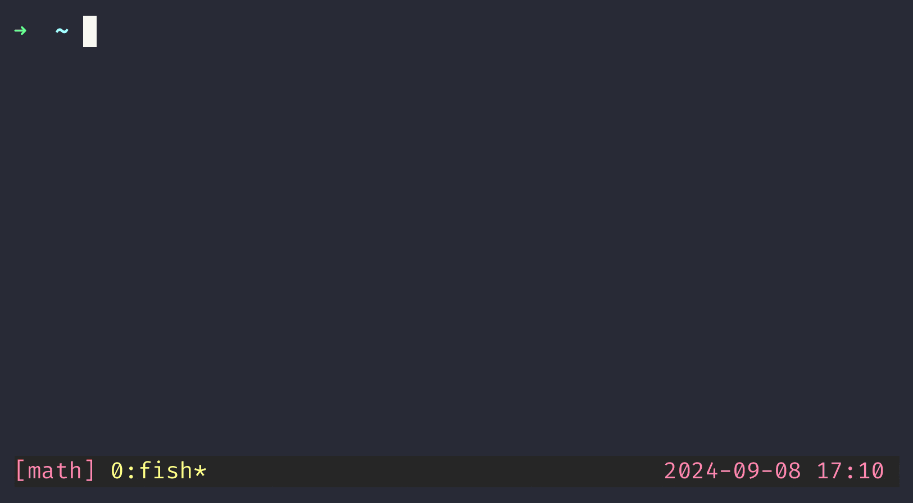

# Gession

Dependency free Tmux Session Manager, just one binary and you are good to go.

## Screenshot


## Demo



## Features

- **Extremely Fast**: Efficiently written in Go, so it's blazing fast.
- **Dependency-free**: Almost no dependencies required to run it. Only one is required, but it's supported by Go team `golang.org/x/term`.
- **Interactive TUI**: A TUI allows you to view, create, switch, and kill tmux sessions.
- **Fuzzy Search**: Quickly find and filter sessions using fuzzy search.
- **Customizable**: Set your own prompts or starting directory.

## Installation

To get started, clone the repository and build the project:

```sh
git clone https://github.com/verte-zerg/gession.git
cd gession
make build
```

## Usage

### Normal Mode

Run it with the following command:

```sh
./gession
```

You can also specify a custom prompt and a starting directory or use the `-prime` mode:

```sh
./gession -i "Your Prompt > " -d /path/to/directory
```

### Default values
- **Prompt**: `input > `
- **Directory**: `$HOME`

### Prime Mode

The `-prime` mode allows you to list directories instead of tmux sessions. This is useful for quickly navigating to project directories.

To use the `-prime` mode, specify the `-prime` flag and provide one or more directories to search for sessions using the `-pd` flag:

```sh
./gession -prime -pd /path/to/dir1 -pd /path/to/dir2
```

### Configuration

Add the following line to your `.tmux.conf` file:
```sh
# Basic
bind f run-shell "tmux neww path/to/gession"
bind o run-shell "tmux neww path/to/gession -prime -pd /path/to/projects"

# Advanced
bind f run-shell "tmux neww path/to/gession -i 'Your Prompt > ' -d /path/to/directory"
bind o run-shell "tmux neww path/to/gession -i 'Your Prime Prompt >' -prime -pd /path/to/projects -pd /path/to/other/projects"
```

To avoid the need to specify the full path to the binary, you can move it to a directory in your `$PATH`.
Just add the following line to your shell configuration file (`~/.bashrc`, `~/.zshrc`, `~/.config/fish/config.fish`).
```sh
# BASH/ZSH
export PATH=$PATH:/path/to/gession

# FISH
fish_add_path /path/to/gession
```

After specifying the path, you can run the TUI with the following command:
```sh
# From the terminal
gession

# In tmux.conf
bind f run-shell "tmux neww gession"
```

## Navigation

- **Up/Down Arrow**: Move up or down in the session list.
- **Enter**: Select the highlighted session or create a new one.
- **Backspace**: Delete the last character in the input.
- **Esc/^C/^D**: Exit the TUI.

To kill a session, type the following command in the input (it supports fuzzy search):
```
:rm <session-name>
```

If you want to create a session, that matches existing session names (based on fuzzy search), you can use the following command:
```
:new <session-name>
```

## Contributing

If you have an idea for a new feature or have found a bug, please open an issue or submit a pull request.

## License

This project is licensed under the MIT License. See the [LICENSE](LICENSE) file for details.

## Conclusion

Elevate your tmux experience with the Tmux Session Manager. Happy coding!
